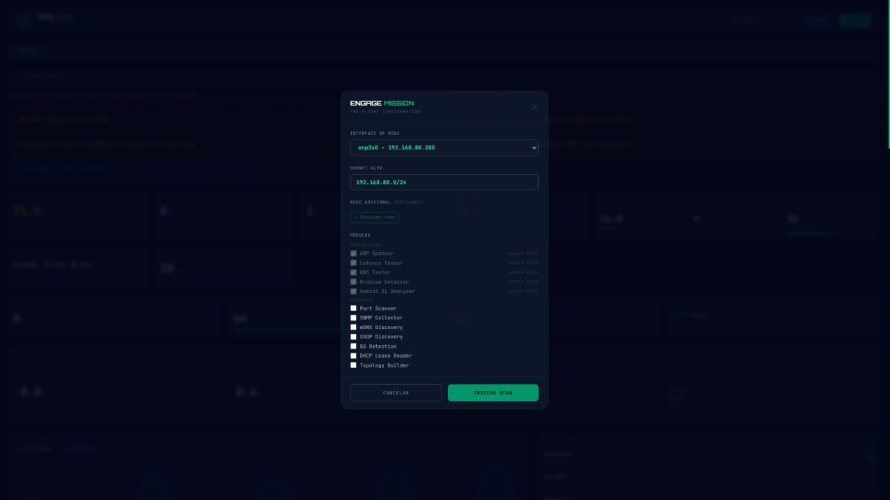

# FOX Network Diagnoser AI

Diagnóstico e monitoramento de redes com FastAPI, CLI, dashboard NOC, integração MikroTik, análise IA e relatórios avançados.



## Principais Recursos
- Dashboard NOC em tempo real (Tailwind, Chart.js)
- Diagnóstico completo: ARP, SNMP, mDNS, SSDP, latência, IA Gemini
- Detecção de topologia física e lógica
- Monitoramento de tráfego e métricas MikroTik
- Alertas críticos: failover WAN, NAT duplo, bridge mode Vivo
- Relatórios PDF e JSON
- CLI robusta para automação

## Instalação
```bash
# Clone o repositório
git clone https://github.com/seu-usuario/fox-network-diagnoser.git
cd fox-network-diagnoser

# (Opcional) Crie e ative um ambiente virtual
python3 -m venv venv
source venv/bin/activate

# Instale as dependências
pip install -r requirements.txt
```

## Uso
- Subir API: `uvicorn api:app --host 0.0.0.0 --port 80`
- Executar diagnóstico CLI: `python app.py`
- Dashboard: acesse `http://<ip-servidor>/app/noc/`

## Estrutura
Veja RESUMO_FINAL.md para detalhes completos.

## Licença
[MIT](LICENSE)
